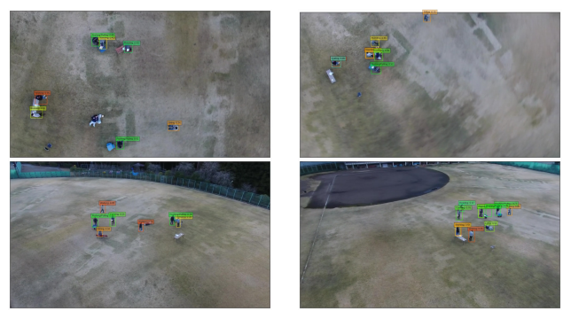

#### INTRODUCTION

_We present Okutama-Action, a new video dataset for aerial view concurrent human action detection. It consists of 43 minute-long fully-annotated sequences with 12 action classes. Okutama-Action features many challenges missing in current datasets, including dynamic transition of actions, significant changes in scale and aspect ratio, abrupt camera movement, as well as multi-labeled actors. As a result, our dataset is more challenging than existing ones, and will help push the field forward to enable real-world applications._

---

#### HIGHLIGHTS
* An aerial view dataset that contains representative samples of actions in real-world airborne scenarios
* Dynamic transition of actions where, in each video, up to 9 actors sequentially perform a diverse set of actions
* A real-world challenge of multi-labeled actors where an actor performs more than one action at the same time.
* A significant increase compared to previous datasets, in number of actors and concurrent actions (up to 10 actions/actors), as well as video resolution (3840x2160) and sequence length (one minute on average).
* Dataset can be used for multiple tasks: 1- pedestrian detection 2- spatio-temporal action detection 3- (under development) multi-human tracking.

---

#### CITATION
If you find this dataset useful, please cite the following paper

Okutama-Action: An Aerial View Video Dataset for Concurrent Human Action Detection
                     
                    <a href="http://barekatain.me/" target="_blank">M. Barekatain</a>,
                    <a href="https://miquelmarti.github.io" target="_blank">M. Martí</a>,
                    <a href="https://www.linkedin.com/in/hsueh-fu-shih-621616b5/" target="_blank">H. Shih</a>,
                    <a href="https://www.linkedin.com/in/samuel-murray-6012545a" target="_blank">S. Murray</a>,
                    <a href="http://knakayama.com/" target="_blank">K. Nakayama</a>,
                    <a href="http://ymatsuo.com/" target="_blank">Y. Matsuo</a>, and
                    <a href="http://research.nii.ac.jp/~prendinger/" target="_blank">H. Prendinger</a>
                     
                                       <i>arXiv:1706.03038, 2017</i> 
                    [<a href="https://arxiv.org/abs/1706.03038" target="_blank">PDF</a>]

---

#### ANNOTATION EXAMPLES (downscaled to 720p)

<iframe width="853" height="480" src="https://www.youtube.com/embed/ZXJCN9zrXPM?rel=0" frameborder="0" allowfullscreen></iframe>

---

#### ACTION CATEGORIES

---

#### DATASET DOWNLOAD

**Video Names**: each video name consists of 3 integers separated by dots. The
definition of these integers from left to right are:

1.   Drone number. Each scenario, with the exception of one, was captured using 2 drones (of different configuration) at the same time.
2.   Part of the day. "1" indicates *morning* and "2" indicates *noon*.
3.   Scenario number.

Hence, the pair of videos with the same last two integers are the same scenario with different drones configuration.

**Labels**:  Each line contains 10+ columns, separated by spaces. The
definition of these columns are:

1.   Track ID. *All rows with the same ID belong to the same person for 180 frames. Then the person gets a new idea for the next 180 frames. We will soon release an update to make the IDs consistant.*
2.   xmin. The top left x-coordinate of the bounding box.
3.   ymin. The top left y-coordinate of the bounding box.
4.   xmax. The bottom right x-coordinate of the bounding box.
5.   ymax. The bottom right y-coordinate of the bounding box.
6.   frame. The frame that this annotation represents.
7.   lost. If 1, the annotation is outside of the view screen.
8.   occluded. If 1, the annotation is occluded.
9.   generated. If 1, the annotation was automatically interpolated.
10.  label. The label for this annotation, enclosed in quotation marks. This field is always "Person".
11. (+)  actions. Each column after this is an action.

There are two label files for each video; one for *single*-action detection and one for *multi-*action detection. Note that labels for *single*-action detection has been created from the *multi*-action detection labels (for more details please refer to our publication). For pedestrian detection task, the columns describing the actions should be ignored.

**Training set (videos & labels)** [link](https://drive.google.com/drive/folders/0B6O3GZcCIFuDaUs4dG1HWWEyUWM?usp=sharing).

---

#### MODELS DOWNLOAD
**Final trained Caffe models** [link](https://drive.google.com/drive/folders/0BydaU2Imk1zjSUpCdFpmbmtEeHc?usp=sharing).

---

#### UPDATES
- We will soon release the metadata for each video sequence, namely camera angle, speed and altitude of the drones.
- We will soon release the test set on CodaLab where it's possible to measure the performance.

---

#### DEVELOPERS TEAM
The creation of this dataset was supported by [Prendinger Lab](http://research.nii.ac.jp/~prendinger/) at the [National Institute of Informatics](http://nii.ac.jp/en/), Tokyo, Japan.

<dl>
<head>

</head>

<body>

  

    

      

        

          <h5 class="member__name">Mohammadamin Barekatain</h5>
          
Technical University of Munich

          <a class="member__link" href="http://barekatain.me/">Read More</a>
        

      

      
    

    

      

        

          <h5 class="member__name"> Miquel Marti </h5>
          
KTH Royal Institute of Technology

          <a class="member__link" href="https://miquelmarti.github.io">Read More</a>
        

      

      
    

    

      

        

          <h5 class="member__name">Hsueh-Fu Shih</h5>
          
National Taiwan University

          <a class="member__link" href="https://www.linkedin.com/in/hsueh-fu-shih-621616b5/">Read More</a>
        

      

      
    

    

      

        

          <h5 class="member__name">Samuel Murray</h5>
          
KTH Royal Institute of Technology

          <a class="member__link" href="https://www.linkedin.com/in/samuel-murray-6012545a">Read More</a>
        

      

      
    

    

      

        

          <h5 class="member__name">Helmut Prendinger</h5>
          
National Institute of Informatics

          <a class="member__link" href="http://research.nii.ac.jp/~prendinger/">Read More</a>
        

      

      
    

</body>

</dl>
###### Contact : m.barekatain at tum dot de
###### Last update : 31/07/2017
